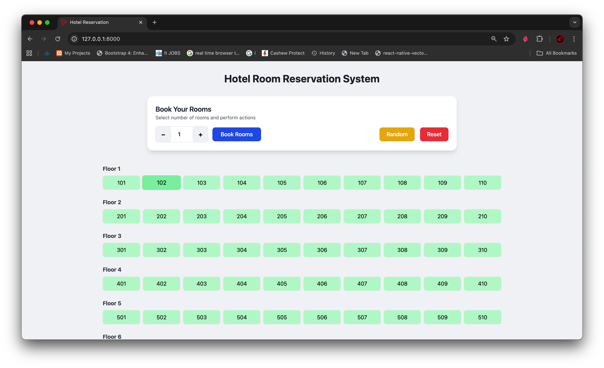
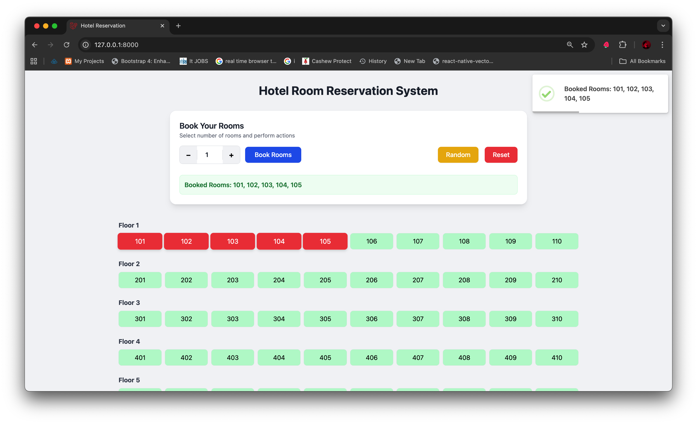
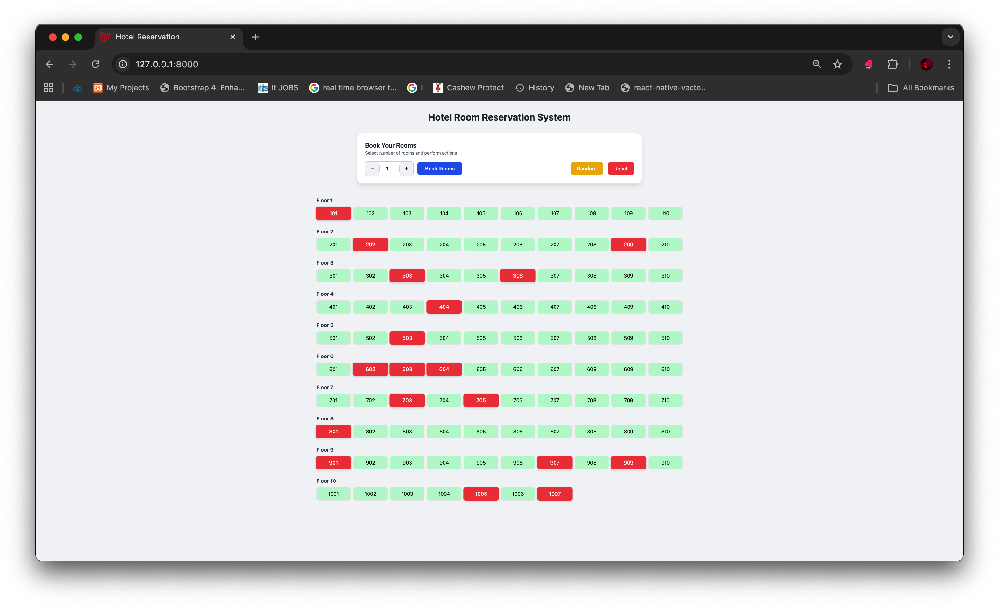

# Hotel Room Reservation System

A sophisticated hotel room booking system that intelligently allocates rooms based on same-floor availability and minimizes guest travel time across multiple floors.

---

## 📋 Table of Contents

- [Overview](#overview)
- [Features](#features)
- [Technical Stack](#technical-stack)
- [Installation](#installation)
- [Usage](#usage)
- [Algorithm](#algorithm)
- [Screenshots](#screenshots)
- [Contact](#contact)

---

## Overview

This system manages a hotel with **97 rooms** distributed across **10 floors**, allowing guests to book up to **5 rooms** at a time. The booking algorithm prioritizes room allocation on the same floor and, when necessary, minimizes total travel time between rooms on different floors.

**Developed by:** Gaurav Kumar  
**Email:** [gauravsbs2@gmail.com](mailto:gauravsbs2@gmail.com)  
**Phone:** +91-7903562598

---

##  Features

- **Smart Booking**: Book 1–5 rooms with intelligent allocation
- **Same-Floor Priority**: Allocates rooms on the same floor when possible
- **Travel Time Optimization**: Minimizes total travel time for cross-floor bookings
- **Random Occupancy Generator**: Simulate hotel occupancy for testing
- **Reset Functionality**: Clear all bookings with one click
- **Visual Hotel Layout**: Interactive grid showing room availability
- **Modern UI**: Responsive design with Tailwind CSS
- **Toast Notifications**: Real-time feedback for all actions
- **Database-Driven**: Powered by Laravel Eloquent ORM

---

##  Technical Stack

| Technology | Purpose |
|------------|---------|
| **Laravel 12.x** | Backend framework |
| **PHP 8.4** | Server-side language |
| **MySQL/SQLite** | Database |
| **Blade Templates** | Frontend templating |
| **Tailwind CSS** | UI styling |
| **SweetAlert2** | Toast notifications |
| **Git** | Version control |

---

##  Installation

### Prerequisites

- PHP >= 8.4
- Composer
- Node.js & npm
- MySQL/SQLite

### Steps

1. **Clone the repository**
   ```bash
   git clone https://github.com/yourusername/hotel-reservation-system.git
   cd hotel-reservation-system
   ```

2. **Install PHP dependencies**
   ```bash
   composer install
   ```

3. **Install Node dependencies**
   ```bash
   npm install
   ```

4. **Configure environment**
   ```bash
   cp .env.example .env
   php artisan key:generate
   ```

5. **Set up database**
   - Update `.env` with your database credentials
   - Run migrations and seeders:
   ```bash
   php artisan migrate --seed
   ```

6. **Build assets**
   ```bash
   npm run dev
   ```

7. **Start the server**
   ```bash
   php artisan serve
   ```

8. **Access the application**
   - Open your browser and navigate to `http://127.0.0.1:8000`

---

##  Usage

### Booking Rooms

1. Enter the number of rooms (1-5) in the input field
2. Click the **"Book Rooms"** button
3. The system will allocate rooms based on:
   - Same-floor availability (priority)
   - Minimum travel time if cross-floor booking is required

### Random Occupancy

- Click **"Generate Random Occupancy"** to simulate hotel bookings
- Useful for testing the booking algorithm with various scenarios

### Reset Bookings

- Click **"Reset All Bookings"** to clear all room reservations
- Returns the hotel to a fully available state

---

##  Algorithm

### Same-Floor Booking

1. Iterates through each floor sequentially
2. Checks if sufficient rooms are available on a single floor
3. Selects **contiguous rooms** to minimize horizontal travel distance

### Cross-Floor Booking

When a single floor cannot accommodate the request:

1. Generates all possible combinations of available rooms (up to 5)
2. Calculates total travel time for each combination:
   - **Horizontal travel**: 1 minute per adjacent room
   - **Vertical travel**: 2 minutes per floor difference
3. Selects the combination with **minimum total travel time**

### Travel Time Formula

```
Total Time = (Horizontal Distance × 1 min) + (Vertical Distance × 2 min)
```

---

##  Screenshots

### Main Interface

*Hotel layout with booking controls*

### Booking Success

*Toast notification on successful booking*

### Random Occupancy


### Reset Booking


### Hotel Layout Grid

*Visual representation of room availability*

---

##  Project Structure

```
hotel-reservation-system/
├── app/
│   ├── Http/Controllers/
│   ├── Models/
│   └── Services/
├── database/
│   ├── migrations/
│   └── seeders/
├── resources/
│   ├── views/
│   └── css/
├── routes/
│   └── web.php
├── public/
└── README.md
```

---

##  Configuration

### Database Schema

**Rooms Table**
- `id`: Primary key
- `floor`: Floor number (1-10)
- `room_number`: Room identifier
- `is_booked`: Booking status (boolean)
- `created_at`, `updated_at`: Timestamps

---

##  Notes

- Maximum booking limit: **5 rooms** per transaction
- Total hotel capacity: **97 rooms** across **10 floors**
- Booking algorithm optimized for **minimum travel time**
- Fully responsive design for mobile and desktop
- Real-time UI updates with toast notifications

---